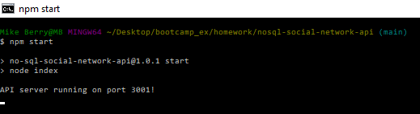

# nosql-social-network-api

## Description

This project aimed to create an Social Network API that combined a Nosql database, MongoDB, with a functional server. The server is started with either npm start or node index.js. In contrast with sql, mongoose can set up a new database when the server is tarted. Once the server is running the user can query the various api endpoints with get requests for users and thoughts to recieve detailed information about each. Get requests on individual users and thoughts based on their internal uuids can also be performed. Each will return more detailed information. For users it will also return populated information on thier posted thoughts and their friends. Post requests to create new entries, put requests to update existing individual entries, and delete requests to delete individual entries are all availible to allow users to interact with the database. Both users and thoughts feature additonal interaction with subdocuments. Users can add and fremove friends from thier friends list via post and delete requests. Thoughts can have reactions added and removed from them with post and delete requests.

This project continued to highlight the use of node.js to write server code using JS. Mongoose was used to connect the server to MongoDB and also acted as an ODM to write database queries and create models in JavaScript. This project showcased a different approach to combined backend code with a database and server.

## Usage

As this project was not deployed, the repo of the project can be found at https://github.com/mgberrysd/nosql-social-network-api

When starting the server from the command line the user should see the following:

A video of the application being run can be found at https://drive.google.com/file/d/1KKiFqJnL_q94huIig56i9abVP8H5WiWv/view

## Credits

The JS backend for the Scoial Network API backend was created by Michael Berry.

The project used the  the node mongoose package as an ODM for MongoDB, and Insomnia for route testing.